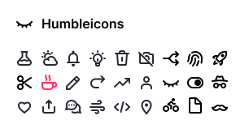

A set of free MIT-licensed hand-crafted, neutral, simple SVG icons for you to use in your web projects.

Browse on **[humbleicons.com](https://humbleicons.com)**.

## Install

Humbleicons are packaged up and published to npm.

```shell
npm i humbleicons
```

## Usage

You can include Humbleicons in these ways:

#### Copy-paste SVGs as embedded HTML

```html
<svg xmlns="http://www.w3.org/2000/svg" fill="none" stroke="currentColor" viewBox="0 0 24 24">
  <g stroke="currentColor" stroke-linecap="round" stroke-width="2">
    <path d="M12 17l-1.5 1.5a3.536 3.536 0 01-5 0v0a3.536 3.536 0 010-5l3-3a3.536 3.536 0 015 0v0"/>
    <path d="M12 7l1.5-1.5a3.536 3.536 0 015 0v0a3.536 3.536 0 010 5l-3 3a3.536 3.536 0 01-5 0v0"/>
  </g>
</svg>
```

#### Use the SVG sprite

```html
<svg class="humbleicons">
  <use xlink:href="humbleicons.svg#desktop"/>
</svg>
```

Recommended global styling:

```css
.humbleicons {
	width: 1.15em;
	height: 1.15em;
	display: inline-block;
	align-self: center;
}
```